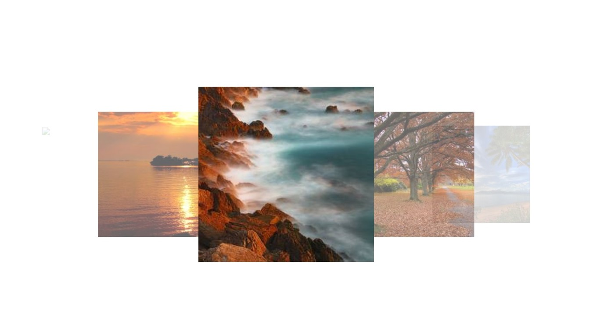
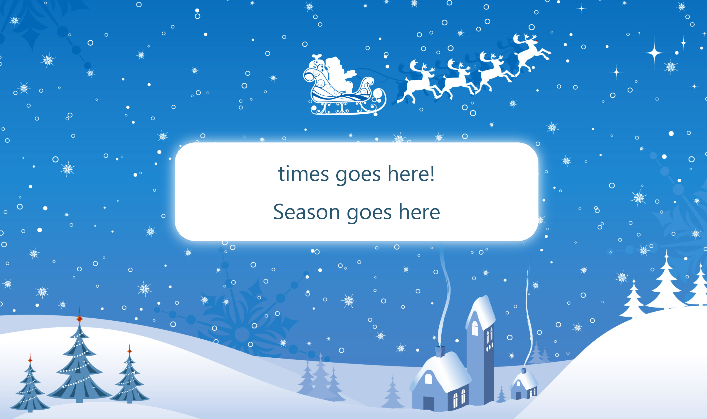
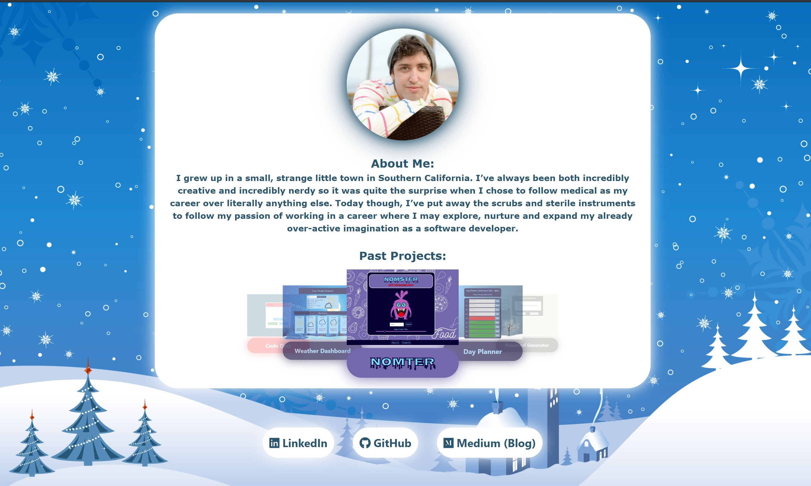

# Project: updated-portfolio-page

For this project, i was responsible for updating or creating a new portfolio which included past completed projects (as if to be used for actual job hunting)
​
## Getting Started
​
As with most projects, i began with creating the needed files which included an index.html, a stlye.css and a script.js.

I started with the index.html, writing out from scratch all the framework basics of the HTML such as the containers, textareas, buttons and displays. I was sure to assign classes along with some unique IDs for areas that i anticipated would require more changes or content later on. This stage of building is typically the easiest but also holds great importance for the overall project's design. It gives the developer a strong sense of how the project is going to look, function and the purpose it will serve.

Next i began looking into outside design APIs such as Bootstrap but, through a classmate, discovered Materialize. To be completely honest, I only used this really for one feature and that was the unique fade-in, fade-out scrolling carousel.

Sadly, this design choice was completely impractical in the overall scheme when considering how many issues and complications it caused.
* The resizing of the display or images didn't work at all.
* The carousel had a strange invisible border that covered over the functionality of other features such as buttons.
* And it didn't respond well to other css features/methods such as fadeIn/fadeOut or altering visibility and display (it would break completely).

..in fact, it didn't respond well to any css changes at all, especially those made in javascript.

Next i began working on a feature that i eventually had to dismiss and that was the seasonal background and style change. I created the clock.js to track dates. initially i wanted to open the page displaying a small message with the current date and a "Happy Winter" or Happy Summer"...something like that. This would not only give the user context to the style choice but would also display more of the backgrounds which i hand-picked for specific styles and themes.

This small window would then fade away as the main content faded into the screen (taking up slightly more of the background image. Sadly, as mentioned above regarding the carousel, i couldn't get the fading to work quite how i wanted. Every method or attempt i tried would break the carousel causing it to display in odd places and function like a broken monitor on crack. Looking back, i was far too stubborn and spent way more time on making this work than i should have. Especially when it came to adding the feature for the background and coloring to change with the seasons. This caused multiple complications throughout and i ultimately had to abandon it for now as i couldn't justify dedicating literally DAYS on a feature that the profile viewer would likely never even notice. I will likely return to it though, possibly when i have time to spare as i really enjoy the concept.

After this defeat i moved onto linking past projects to the carousel. I DEFINITELY spent too much time on this part as i wanted to not only display an image/link of each project but i also wanted to display its name with the individual project's color-scheme including hover features from each (same color format or at least matching). This took a silly rediculous amount of time to do but i had fun with it so i suppose that makes it worth the trouble even if it doesn't show.

Overall, i wanted to keep this project simple and cute in terms of appearence. Similar to past projects, i tend to adopt a style of central objects with unique backgrounds and colorful bubbly displays. I certainly plan to step out of that comfort zone with future projects making a more modern or technical display (to show a diversity in my styling) but for my portfolio i wanted to go with what i enjoy most. It is about me, after-all.

## Built With
​
* [HTML](https://developer.mozilla.org/en-US/docs/Web/HTML)
* [CSS](https://developer.mozilla.org/en-US/docs/Web/CSS)
* [Materialize](https://materializecss.com/)
* [Javascript](https://developer.mozilla.org/en-US/docs/Web/JavaScript)
​
## Deployed Link
​
* [See Live Site](https://casey-moldavon.github.io/updated-portfolio-page/)
​
​
## Authors
​
* **Casey Moldavon** 
​
- [Link to Portfolio Site](https://casey-moldavon.github.io/updated-portfolio-page/)
- [Link to Github](https://github.com/casey-moldavon/updated-portfolio-page)
- [Link to LinkedIn](https://www.linkedin.com/in/casey-moldavon-442a1761/)
​
See also the list of [contributors](https://github.com/your/project/contributors) who participated in this project.
​
## License
​
This project is licensed under the MIT License 
​
## Acknowledgments
​
* Big thanks to Christopher Melby as well as Andres Felipe Jimenez